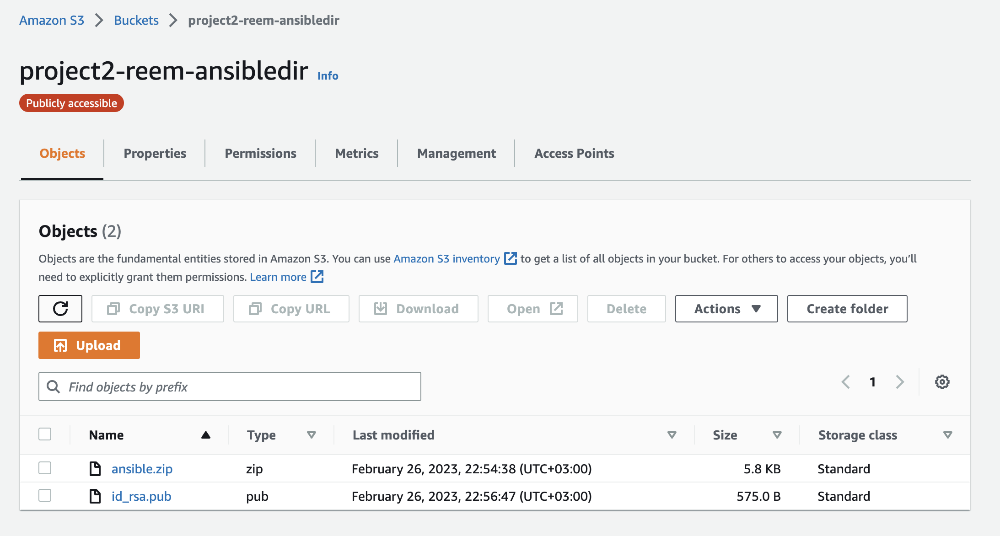

# Author
Reem Mokhtar
[reem.mokhtar](https://www.linkedin.com/in/reematcs/)

# Name

Using Terraform and Ansible to provision, Jenkins to Automate Maven packing of WAR file and deployment to Tomcat 9

# Table Of Contents
<!-- TOC start -->
- [Name](#name)
- [Table of Contents](#table-of-contents)
- [Description](#description)
  * [Overview](#overview)
  * [Directory Structure](#directory-structure)
  * [Usage](#usage)
  * [Summary of Steps Performed](#summary-of-steps-performed)
- [Terraform](#terraform)
  * [1. Setup](#1-setup)
    + [1. Basic Setup](#1-basic-setup)
    + [2. Security Groups](#2-security-groups)
    + [3. S3 bucket](#3-s3-bucket)
    + [4. IAM role](#4-iam-role)
  * [2. Provisioning and Deployment Server Instances](#2-provisioning-and-deployment-server-instances)
    + [1. Provisioning Server](#1-provisioning-server)
    + [2. Deployment Server](#2-deployment-server)
    + [3. Inventory file in Ansible Provisioning Directory](#3-inventory-file-in-ansible-provisioning-directory)
    + [4. Zipping Ansible Provisioning Directory](#4-zipping-ansible-provisioning-directory)
    + [5. Upload to S3 bucket](#5-upload-to-s3-bucket)
    + [6. Ansible Provisioning Directory Download to Provisioning Server](#6-ansible-provisioning-directory-download-to-provisioning-server)
    + [7. Copy SSH Public Key to Deployment Server](#copy-ssh-public-key-to-deployment-server)
- [Ansible](#ansible)
  * [1. Tomcat Setup on Deployment Server](#1-tomcat-setup-on-deployment-server)
      - [1. `tomcat_playbook.yml`](#1-tomcat_playbookyml)
      - [2. Tomcat Installation](#2-tomcat-installation)
  * [2. Build and Deploy WAR](#2-build-and-deploy-war)
    + [1. Clone and Build Hello World WAR File](#2-clone-and-build-hello-world-war-file)
    + [2. Deploy WAR File and Restart Tomcat on Deployment Server](#3-deploy-war-file-and-restart-tomcat-on-deployment-server)
  * [3. Run Ansible Plays in Terraform](#3-run-ansible-plays-in-terraform)
<!-- - [Jenkins: ](#jenkins)
  * [1. Manual Setup of Pipeline](#1-manual-setup-of-pipeline)
  * [2. Testing and Validating Pipeline](#2-testing-and-validating-pipeline) -->
<!-- TOC end -->
<!-- TOC -->
# Description

## Overview

Terraform, an open-source IaC is used to spin up a EC2 server instance, a deployment instance and S3 bucket to upload ansible provisioning playbooks. 
## Directory Structure
```
Project
├── README.md
├── main.tf
├── aws_terraform.pem
├── variables.tf
├── bucket.tf
├── ansible_provisioning
│   ├── ...
├── providers.tf
└── outputs.tf

13 directories, 22 files
```
## Usage

1. Create a key pair in AWS, download and replace `aws_terraform.pem`.
3. Copy VPC ID from AWS and place in `variables.tf` as the default value for `vpc_id`.
4. Copy Ubuntu AMI id and place in `variables.tf` as the default value for `ami_id`.
5. Copy AWS access key, secret key, and token and place in `variables.tf` as the default value for `aws_access_key`, `aws_secret_key`, `aws_token`.
6. Run terraform commands in the cloned directory:
  * `terraform init`
  * `terraform plan`
  * `terraform apply -auto-approve`

## Summary of Steps Performed

1. [Terraform](#terraform)
    1. Spun up `S3` bucket
    2. Spun up 2 `EC2` instances, provisioning server and deployment, and generated their public and private ips. Attached necessary IAM role to `EC2` instances to access `S3` bucket.
    3. Placed Ansible provisioning playbooks and roles, with inventory file for deployment ip address. Zipped using Terraform and uploaded to `S3` bucket.
    4. Downloaded ansible playbook using `awscli` commands from `S3` bucket to `EC2` provisioning server. Unzipped. Generated ssh keys to connect with deployment server and uploaded to `S3` bucket.
    5. Downloaded ssh public key from `S3` bucket using `awscli` commands to deployment instance and appended to ssh authorized keys.
    6. Used Terraform to run ansible playbooks.
2. [Ansible](#ansible)
    1. Tomcat setup on deployment server.
    2. Clone and build "Hello World" WAR file using `maven` on provisioning server.
    3. Deploy WAR file and restart Tomcat on deployment server.
3. [Jenkins](#jenkins)
    1. Manual setup of pipeline in [previous step](#ansible)
    2. Testing and validating pipeline.


# Terraform
## 1. Setup
### 1. Basic Setup
Inside `main.tf`, we ensure that Terraform uses a specific version for Terraform and our required providers (aws).

```HCL
terraform{
required_version = ">= 1.0" # semver 
      required_providers {
        aws = {
          source = "hashicorp/aws"
          version = "4.55.0"
        }
      }
}
```
Inside `variables.tf`, we setup the requirements for our Virtual Private Cloud and instance settings, as well as the AWS key `aws_terraform_keyname` for creating, managing and accessing our resources.

```HCL
variable "ami_id" {
    default = "ami-00eeedc4036573771" 
}
variable "vpc_id"{
    default="vpc-056d622c7a32e4729"
}
variable "aws_terraform_keyname" {
    default = "aws_terraform"
}
variable "aws_access_key" {
    default = "..."
}
variable "aws_secret_key" {
default = "..."
}
variable "aws_token" {
  default = "..."
}
variable "region" {
    default = "us-east-2"
}
```
Inside `main.tf`, we use the variables we specified earlier to 
```HCL
locals {
  ami_id = "${var.ami_id}"
  vpc_id = "${var.vpc_id}"
  ssh_user = "ubuntu"
  key_name = "${var.aws_terraform_keyname}"
  private_key_path = "${var.aws_terraform_keyname}.pem"
}
```

### 2. Security Groups

Both provisioning and deployment servers require a security group. Since both require ports `22`, `80`, `8080`, we can use the same security group for both.

```HCL
resource "aws_security_group" "server_sec_group" {
	name   = "server_sec_group"
	vpc_id = local.vpc_id

  ingress {
		from_port   = 22
		to_port     = 22
		protocol    = "tcp"
		cidr_blocks = ["0.0.0.0/0"]
	}
  ingress {
		from_port   = 80
		to_port     = 80
		protocol    = "tcp"
		cidr_blocks = ["0.0.0.0/0"]
	}
  ingress {
		from_port   = 8080
		to_port     = 8080
		protocol    = "tcp"
		cidr_blocks = ["0.0.0.0/0"]
	}
  egress {
		from_port   = 0
		to_port     = 0
		protocol    = "-1"
		cidr_blocks = ["0.0.0.0/0"]
	}
}
```

### 3. S3 bucket
In `variables.tf`, the bucket name and acl are defined, with a public-read access control list (ACL).

```HCL
variable "bucket_name" {
    default = "project2-reem-ansibledir"
}
variable "acl_value" {
    default = "public-read"
}
```

In `bucket.tf`, the `S3` bucket is defined:

```HCL
resource "aws_s3_bucket" "b1" {
  bucket = "${var.bucket_name}" 
  force_destroy=true
  tags = {
    Name        = "${var.bucket_name}"
    Environment = "Dev"
  }
}

resource "aws_s3_bucket_acl" "ansible_provision" {
  bucket = aws_s3_bucket.b1.id
  acl    = "${var.acl_value}"
}
```


### 4. IAM role

In order to facility access from the provisioning and deployment servers to the `S3` bucket, an Identity and Access Management policy and role need to be defined and applied to the server instances. Otherwise, downloading and uploading objects to and from the servers will not work with `awscli`.

In `main.tf`, a `aws_iam_policy` is defined that can allow for access to all objects under an AWS `S3` bucket.

```HCL
resource "aws_iam_policy" "access-s3-policy" {
  name        = "S3-access-policy"
  description = "Provides permission to access S3"

  policy = jsonencode({
    "Version": "2012-10-17",
    "Statement": [
        {
            "Effect": "Allow",
            "Action": [
                "s3:*",
                "s3-object-lambda:*"
            ],
            "Resource": "*"
        }
    ]
})
}
```
A `aws_iam_role` is created that allows `EC2` instances with this policy attached to assume this role.

```HCL
resource "aws_iam_role" "access_bucket_role" {
  name = "access_bucket_role"

  assume_role_policy = jsonencode({
  "Version": "2012-10-17",
  "Statement": [
    {
      "Sid": "",
      "Effect": "Allow",
      "Principal": {
        "Service": [
          "ec2.amazonaws.com"
        ]
      },
      "Action": "sts:AssumeRole"
    }
  ]
})

}
```
The defined `aws_iam_policy` is attached to the defined `aws_iam_role` through a `aws_iam_policy_attachment`.

```HCL
resource "aws_iam_policy_attachment" "bucket-role-attach" {
  name       = "role-attachment"
  roles      = [aws_iam_role.access_bucket_role.name]
  policy_arn = aws_iam_policy.access-s3-policy.arn
}
```
The defined `aws_iam_role` is passed through an `aws_iam_instance_profile`.

```HCL
resource "aws_iam_instance_profile" "access-s3-profile" {
  name = "access-s3-profile"
  role = aws_iam_role.access_bucket_role.name
}
```
## 2. Provisioning and Deployment Server Instances


### 1. Provisioning Server

In `main.tf`, the `aws_instance` for the provisioning server takes in the machine image `ami` for ubuntu, belongs to the same VPC and has the same security group applied, the same AWS key, and `aws_iam_instance_profile` that we created earlier in the [IAM section](#4-iam-role). Connection details are standard. Under `user_data`:
* We perform an `apt update`.
* Install `awscli` to upload and download to the `S3` bucket.
* Install `ansible` to provision the deployment server.
* Install `git` to clone the necessary repository
* Install `maven` to package the WAR file and
* Install java and `jenkins` as required.

To overcome interactive prompts that can halt application of the script when starting the instance, the `-y` option is provided.

```HCL

resource "aws_instance" "ansible_provisioning_server" {
  ami = local.ami_id
  instance_type = "t2.micro"
  associate_public_ip_address = "true"
  vpc_security_group_ids =[aws_security_group.server_sec_group.id]
  key_name = local.key_name
  iam_instance_profile = aws_iam_instance_profile.access-s3-profile.name

  tags = {
    Name = "Ansible_Provisioning_Server"
  }

  connection {
    type = "ssh"
    host = self.public_ip
    user = local.ssh_user
    private_key = file(local.private_key_path)
    timeout = "4m"
  }
  user_data = <<EOF
#!/bin/bash
sudo apt-add-repository -y ppa:ansible/ansible
curl -fsSL https://pkg.jenkins.io/debian-stable/jenkins.io.key | sudo tee /usr/share/keyrings/jenkins-keyring.asc > /dev/null
echo deb [signed-by=/usr/share/keyrings/jenkins-keyring.asc] https://pkg.jenkins.io/debian-stable binary/ | sudo tee /etc/apt/sources.list.d/jenkins.list > /dev/null
sudo apt update
sudo apt install unzip -y
sudo apt install ansible -y
sudo apt install openjdk-11-jdk -y
sudo apt install maven -y
sudo apt install awscli -y
sudo apt install git -y
sudo apt install jenkins -y
sudo systemctl start jenkins.service 
EOF
}
```
### 2. Deployment Server

In `main.tf`, the `aws_instance` for the deployment server takes in the machine image `ami` for ubuntu, belongs to the same VPC and has the same security group applied, the same AWS key, and `aws_iam_instance_profile` that we created earlier in the [IAM section](#4-iam-role). Connection details are standard. Under `user_data`:
* We perform an `apt update`
* Install `acl` to support access control list querying and setting for `S3` buckets through CLI.
* Install `awscli` to upload and download to the `S3` bucket.

To overcome interactive prompts that can halt application of the script when starting the instance, the `-y` option is provided.
```HCL
resource "aws_instance" "ansible_deployment" {
  ami = local.ami_id
  instance_type = "t2.micro"
  associate_public_ip_address = "true"
  vpc_security_group_ids =[aws_security_group.server_sec_group.id]
  key_name = local.key_name
  iam_instance_profile = aws_iam_instance_profile.access-s3-profile.name

  tags = {
    Name = "Ansible_Provisioning_Deployment"
  }

  connection {
    type = "ssh"
    host = self.public_ip
    user = local.ssh_user
    private_key = file(local.private_key_path)
    timeout = "4m"
  }
   user_data = <<EOF
#!/bin/bash
sudo apt update
sudo apt install acl -y
sudo apt install awscli -y
EOF
}
```

**Creation of AWS Instances:**


**Creation of AWS resources mentioned**


### 3. Inventory file in Ansible Provisioning Directory

Once the AWS `EC2` instances are spun up, we would like to save the deployment server's private IP address in a `inventory` file under the directory `ansible_provisioning`.

Should we end up performing `terraform destroy`, I would like to remove the `ansible.zip` file that is generated [further on](#4-zipping-ansible-provisioning-directory). 

To that end, we add the following `local_file` `resource`, which writes out the private ip address under the group `[webservers]`. In order to avoid the interactive prompt when performing ssh to add the new host to the host group, we add the `StrictHostKeyChecking=no` argument to the variables of the host group.

```HCL
resource "local_file" "tf_ansible_inventory" {
  content = <<-DOC
    # Generated by Terraform mgmt configuration.

    [webservers]
    ${aws_instance.ansible_deployment.private_ip}

    [webservers:vars]
    ansible_ssh_common_args="-o StrictHostKeyChecking=no"
    DOC
  filename = "./ansible_provisioning/inventory"
  
  provisioner "local-exec" {
    when    = destroy
    command = "rm ansible.zip"
 }
}
```
### 4. Zipping Ansible Provisioning Directory

In order to upload the directory to the `S3` bucket, the simplest way is to compress it prior to the upload. This can be done via the `archive_file` data source, with the source directory specified as `ansible_provisioning`, which contains all ansible playbooks, roles, and the newly-generated `inventory` file. I also add the `depends_on` meta-argument to allow the compression only to be performed when the `inventory` file has been created in the `ansible_provisioning` directory.

```HCL
data "archive_file" "data_backup" {
  type        = "zip"
  source_dir = "./ansible_provisioning"
  output_path = "${var.ansible_zip}"
  depends_on = [
    local_file.tf_ansible_inventory
 ]
}
```
### 5. Upload to S3 bucket

To upload the zip file that was created in the [previous step](#4-zipping-ansible-provisioning-directory), we use the `aws_s3_object` resource and specify the source to be the newly-created zip file. I also set the `depends_on` meta-argument to depend on the [previous step](#4-zipping-ansible-provisioning-directory).

```HCL
# Upload an object
resource "aws_s3_object" "upload_ansible" {
    bucket = aws_s3_bucket.b1.id
    key = "${var.ansible_zip}"
    source = "${var.ansible_zip}"
    #etag = filemd5("${var.ansible_zip}")
depends_on = [
    data.archive_file.data_backup
 ]
}
```

**Created S3 bucket on AWS**:



### 6. Ansible Provisioning Directory Download to Provisioning Server

To start setting up the provisioning server and download the `ansible.zip` from our `S3` bucket, we will need to use a `null_resource` which connects to the aws instance `ansible_provisioning_server` that has just been created. 

First, we generate the ssh rsa key-pair. To avoid interactive prompts, we first make sure we are using the shell `#!/bin/bash`, and pass `<<< y` to ensure yes is passed to the `ssh-keygen` prompt.

Next, we want to make sure that the `unzip` and `awscli` packages have been installed before proceeding, so we perform a while loop that sleeps 10 seconds if the desired command does not succeed.

```bash
sudo aws s3 cp /home/ubuntu/.ssh/id_rsa.pub s3://${aws_s3_bucket.b1.id}/id_rsa.pub
```

This copies the newly-generated ssh public key to the `S3` bucket. This will be downloaded to the deployment server later.

```bash
sudo aws s3 cp s3://${aws_s3_bucket.b1.id}/ansible.zip .
```

This will download the zip file from our `S3` bucket to the current (home) directory in the provisioning server.

```bash
unzip ansible.zip
```

This will unzip the file that was just downloaded.

```HCL
resource "null_resource" "InitialSetup" {
 
  connection {
    type = "ssh"
    host = aws_instance.ansible_provisioning_server.public_ip
    user = local.ssh_user
    private_key = file(local.private_key_path)
    timeout = "4m"
  }

  provisioner "remote-exec" {
    inline = [
      "#!/bin/bash",
      "ssh-keygen -q -t rsa -N '' -f ~/.ssh/id_rsa <<<y >/dev/null 2>&1",
      "cat ~/.ssh/id_rsa.pub",
      "while ! which unzip; do sleep 10; echo \"Sleeping for a bit to make sure unzip is installed.\"; done",
      "while ! which aws; do sleep 10; echo \"Sleeping for a bit to make sure awscli is installed.\"; done",
      "sudo aws s3 cp /home/ubuntu/.ssh/id_rsa.pub s3://${aws_s3_bucket.b1.id}/id_rsa.pub",
      "sudo aws s3 cp s3://${aws_s3_bucket.b1.id}/ansible.zip .",
      "unzip ansible.zip",
    ]
  }
  depends_on = [
    aws_s3_object.upload_ansible, 
    aws_instance.ansible_provisioning_server
  ]
}
```

**Terraform execution of `null_resource.Initial_Setup - ssh connection and generation of rsa key pair:**


**Terraform execution of `null_resource.Initial_Setup - upload public key, download zip and perform unzip:**


**Ansible provisioning server contents after performing unzip:**


### 7. Copy SSH Public Key to Deployment Server

In order to allow ansible to connect to the deployment server from the provisioning server, we need to copy the public key from the `S3` bucket to the deployment server.


```HCL
resource "null_resource" "CopyPubTodeployment" {
 
  connection {
    type = "ssh"
    host = aws_instance.ansible_deployment.public_ip
    user = local.ssh_user
    private_key = file(local.private_key_path)
    timeout = "4m"
  }

  provisioner "remote-exec" {
    inline = [
      "#!/bin/bash",
      "while ! which aws; do sleep 10; echo \"Sleeping for a bit...\"; done",
      "sudo aws s3 cp s3://${aws_s3_bucket.b1.id}/id_rsa.pub .",
      "cat id_rsa.pub >> ~/.ssh/authorized_keys",
    ]
  }
  depends_on = [
    null_resource.InitialSetup
  ]
}
```

**Terraform execution of null_resource.CopyPubTodeployment - ssh connection and download of public key:**


Above, we use a `null resource` to connect to the deployment server, check that `awscli` is installed, then copy the public key into authorize_keys.

```bash
sudo aws s3 cp s3://${aws_s3_bucket.b1.id}/id_rsa.pub .
cat id_rsa.pub >> ~/.ssh/authorized_keys
```

We will halt discussing our Terraform setup for now and jump to [ansible](#ansible), where we run `ansible-playbook` commands from within Terraform using playbooks.


# Ansible

## 1. Tomcat Setup on Deployment Server

Here is the folder structure for `ansible_provisioning`:

```
ansible_provisioning
├── tomcat_playbook.yml
├── deploy_war.yml
├── inventory
├── tomcat_installation_role
│   ├── ...
├── deploy_war_role
│   ├── ...
└── maven_build_role
    ├── ...
```

The two YAML files `tomcat_playbook.yml` and `deploy_war.yml` perform Tomcat installation and WAR deployment on the deployment server from the ansible provisioning server. They use the `inventory` file with our host groups and the roles defined the the `*_role` directories.

We use 
`tomcat_playbook.yml` and directory `tomcat_installation_role`. The YAML instructions here are a slightly-modified version of the ones from [devopstricks.in](https://www.devopstricks.in/installing-tomcat-server-on-ubuntu-22-04-with-ansible/).

#### 1. `tomcat_playbook.yml`


```YAML
- name: Install Tomcat
  hosts: webservers
  become: true
  vars:
    - TOMCAT9_URL: "https://dlcdn.apache.org/tomcat/tomcat-9/v9.0.72/bin/apache-tomcat-9.0.72.tar.gz" 
      
  roles:
    - role: tomcat_installation_role
```

This specifies that the task is applied to the host group `webservers` and requires privilege escalation to `root`. It also defines the variable `TOMCAT9_URL` with the URL for tomcat version 9, and calls on the role defined in the `tomcat_installation_role` directory.

#### 2. Tomcat Installation

```
tomcat_installation_role
├── files
│   ├── localhost
│   │   ├── host-manager.xml
│   │   └── manager.xml
│   └── tomcat-users.xml
├── tasks
│   └── main.yml
└── tests
    ├── inventory
    └── test.yml
```

1. Files:

    As a quick-workaround to configuring gui-manager admin settings (not recommended): 
      1. We modify and overwrite the built-in `tomcat-users.xml` configuration file as suggested with username: `admin`, password `cu1984`.
      2. To allow external access to the manager, we need to modify `host-manager.xml` and `manager.xml` and place them under the localhost directory under `conf/Catalina`. You can see this in the next section.

  2. Tasks:

      Under `tomcat_installation_role/tasks/main.yml`


      ```YAML
      ---
      # tasks file for tomcat_installation_role
      - name: Update apt-get repo and cache
        apt: update_cache=yes force_apt_get=yes cache_valid_time=3600 

      - name: Install Java
        apt:
          name: openjdk-11-jdk
          state: present

      - name: Download Tomcat
        get_url:
          url: "{{ TOMCAT9_URL }}"
          dest: /tmp/
          validate_certs: no

      - name: Creating Apache Tomcat home directory.
        command: mkdir /opt/tomcat   
          
      - name: Extract Tomcat
        shell: tar -xzvf /tmp/apache-tomcat-*tar.gz -C /opt/tomcat --strip-components=1

      - name: overwrite localhost in conf/Catalina
        copy:
          src: localhost/
          dest: /opt/tomcat/conf/Catalina/localhost

      - name: overwrite tomcat-users.xml in conf
        copy:
          src: tomcat-users.xml
          dest: /opt/tomcat/conf/tomcat-users.xml

      - name: Start Tomcat
        shell: /opt/tomcat/bin/startup.sh
        ignore_errors: true

      - name: Wait for Tomcat to start
        wait_for:
          host: localhost
          port: 8080
          state: started

      - name: Connect to Tomcat server on port 8080 and check status 200 - Try 5 times
        tags: test
        uri:
          url: http://localhost:8080
        register: result
        until: "result.status == 200"
        retries: 5
        delay: 10
      ```

This role is clear, but can be explained further in the link referenced above.


## 2. Build and Deploy WAR

We use `deploy_war.yml`, and directories `maven_build_role`, and `deploy_war_role`

```YAML
---
- name: clone repo from github and build package with maven
  hosts: localhost
  become: true
  roles:
    - role: maven_build_role
- name: deploy war file to tomcat in deployment
  hosts: webservers
  become: true
  roles:
    - role: deploy_war_role
```

### 1. Clone and Build Hello World WAR File
```
maven_build_role
├── tasks
│   └── main.yml
└── tests
    ├── inventory
    └── test.yml
```

`maven_build_role\tasks\main.yml`

```YAML
---
# tasks file for maven_build_role
- name: clone repo
  git:
    repo: https://github.com/kliakos/sparkjava-war-example.git
    dest: /home/ubuntu/sparkjava-war-example
    clone: yes
- name: run maven command mvn package
  shell:
    chdir: sparkjava-war-example
    cmd: mvn package
```

### 2. Deploy WAR File and Restart Tomcat on Deployment Server

```
deploy_war_role
├── tasks
│   └── main.yml
└── tests
    ├── inventory
    └── test.yml
```
`deploy_war_role\tasks\main.yml`

```YAML
---
# tasks file for deploy_war_role
- name: clone repo
  copy:
    src: /home/ubuntu/sparkjava-war-example/target/sparkjava-hello-world-1.0.war
    dest: /opt/tomcat/webapps/sparkjava-hello-world-1.0.war
  
- name: Shutdown Tomcat
  shell: /opt/tomcat/bin/shutdown.sh
  ignore_errors: true

- name: Start Tomcat
  shell: /opt/tomcat/bin/startup.sh
  ignore_errors: true

- name: Wait for Tomcat to start
  wait_for:
    host: localhost
    port: 8080
    state: started

- name: Connect to Tomcat server on port 8080 and check status 200 - Try 5 times
  tags: test
  uri:
    url: http://localhost:8080
  register: result
  until: "result.status == 200"
  retries: 5
  delay: 10
```

## 3. Run Ansible Plays in Terraform

```HCL
resource "null_resource" "FinalSetup" {
 
  connection {
    type = "ssh"
    host = aws_instance.ansible_provisioning_server.public_ip
    user = local.ssh_user
    private_key = file(local.private_key_path)
    timeout = "4m"
  }

  provisioner "remote-exec" {
    inline = [
      "#!/bin/bash",
      "ansible-playbook -i ./inventory tomcat_playbook.yml",
      "ansible-playbook -i inventory deploy_war.yml",
      "echo \"URL: http://${aws_instance.ansible_deployment.public_ip}:8080/sparkjava-hello-world-1.0/hello\"",
      "sudo cat /var/lib/jenkins/secrets/initialAdminPassword"
    ]
  }
  depends_on = [
    null_resource.CopyPubTodeployment
  ]
}
```

**Terraform execution of null_resource.FinalSetup - running ansible playbooks and printing deployment server URL Hello World webapp:**


**Contents of Tomcat deployment server `/opt/tomcat` directory:**


**Terraform execution of null_resource.FinalSetup - printing deployment server URL Hello World webapp:***


<!-- 
# Jenkins
## 1. Manual Setup of Pipeline
## 2. Testing and Validating Pipeline -->

